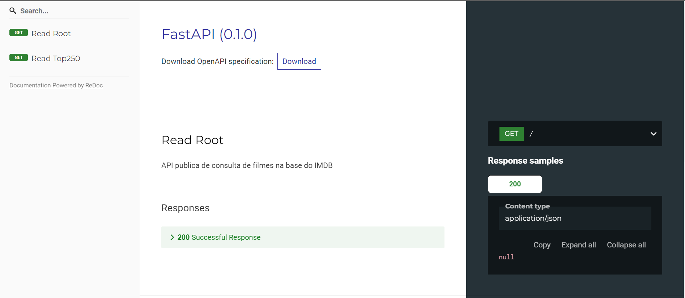

# api-imdb-python #7DaysOfCode

Projeto de treinamento e estudo - #7DaysofCode - Alura  
Necessario se cadastrar no [Imdb](https://imdb-api.com/) para gerar o api_key de consulta do projeto  

## Dependencias do Projeto 
 
Necessário para funcionamento do projeto, todo desenvolvido em devcontainer  
sem a necessidade de instalação extra apenas Docker rodando na maquina, Windows ou Linux

 - Docker - Docker Containers
 - Vscode
    - plugin Remote - Containers
 - Python 3
 - FastAPI
 - Postgresql  // Comentado nas configurações

## Get-Started

Após baixar o repositorio, entre no devcontainer e rode:

**Processo já automatizado no deploy.sh**

crie um arquivo .env com as informações
 - HOST_IMDB=https://imdb-api.com
 - API_KEY=<chave-imdb>

no diretorio app/ 
 
```bash
uvicorn main:app --env-file .env --reload

INFO:     Will watch for changes in these directories: ['/workspace/app']
INFO:     Loading environment from '.env'
INFO:     Uvicorn running on http://127.0.0.1:8000 (Press CTRL+C to quit)
INFO:     Started reloader process [4911] using StatReload
INFO:     Started server process [4913]
INFO:     Waiting for application startup.
INFO:     Application startup complete.
``` 
 - http://localhost:8000/redoc
 

## Referencias 

- [Alura #7DaysofCode](https://7daysofcode.io/matricula/java)
- [FastAPI](https://fastapi.tiangolo.com)
- [Microsoft DevContainer](https://code.visualstudio.com/docs/remote/containers)